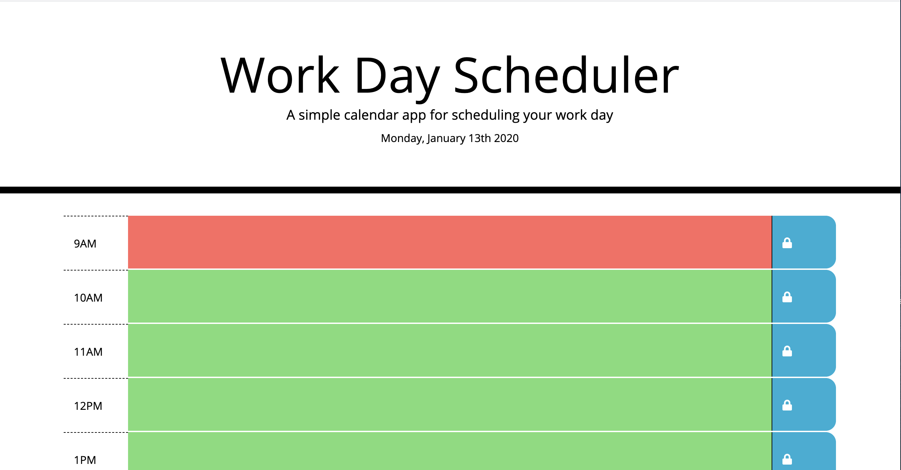
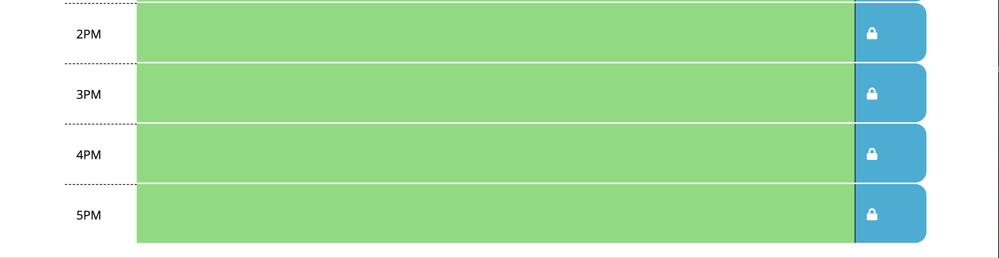
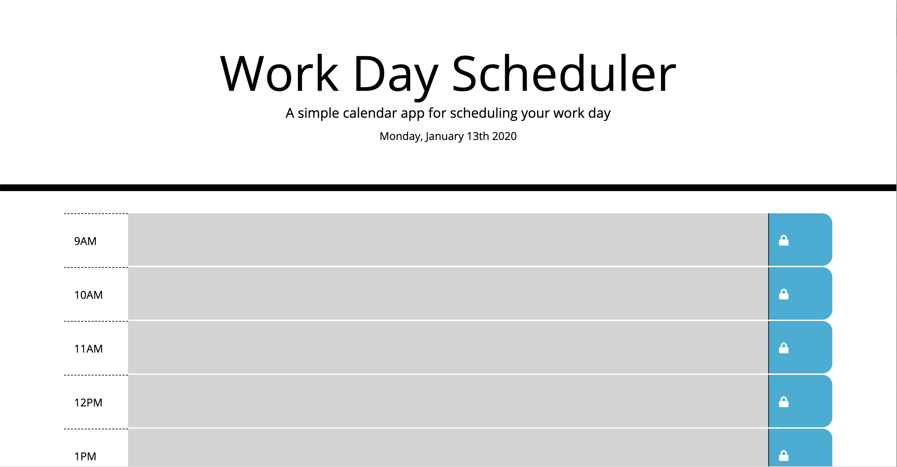

# Day Planner
Calendar application

## Description:

This is a calendar application that allows the user to save events for each hour of the day. The app displays standard business hours (9 a.m. to 5 p.m.)

Each time slot represents one hour and contains the following:

- The time

- A field to hold user input

- A save button

Clicking on the save button will store the time and user input in localStorage.

Near the top of the calendar, the application displays the current day. Each hour is color coded to reflect whether the time slot is in the past, the present, or the future. This changes depending on the time of day.

 

## Usage:

1. The current day is displayed at the top of the calendar.

2. The application displays timeblocks for standard business hours (9 a.m. to 5 p.m.).

3.  Each timeblock contains an input field and save button.

4. Clicking a timeblock's "Save" button stores the input text in local storage, allowing the text to persist when the application is refreshed.

5. Each timeblock is color coded to indicate whether it is in a past, present, or future hour.

    Past - Grey (#d3d3d3)

    Present - Red (#ff6961)

    Future - Green (#77dd77)

 

## Technologies:

HTML 5,CSS 3, jQuery 3.4.1

 

## Screenshots:

